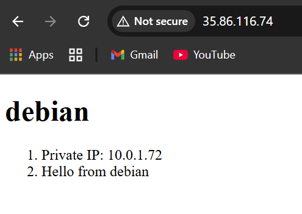
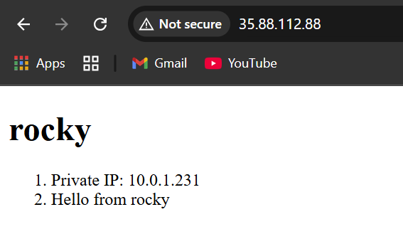

# 4640-makeup-lab

## Setup

### Generate an SSH key pair
1. Run the following command:
```
ssh-keygen -t ed25519 -f ~/.ssh/aws -C "makeup-lab"
```
### Add public key to AWS
1. Navigate to the `scripts` folder of the project directory (ex: `<insert_some_path_here>/acit-4640-makeup/scripts`)
2. Run the following command to execute the upload key script
```
./upload_ssh_key ~/.ssh/aws.pub
```
We are passing in the `aws.pub` public key we made earlier as an argument into the script `upload_lab_key` for it to add the key to our AWS account.

### Creating Infrastructure using Terraform
1. Navigate to the `terraform` folder of the project directory (ex: `<insert_some_path_here>/acit-4640-makeup/terraform`)
2. Run the following command to initialize the directory:
```
terraform init
```
3. Run the following command to format your terraform configuration:
```
terraform fmt
```
4. Run the following command to check the syntax of your terraform configuration:
```
terraform validate
```
5. See what kinds of steps terraform would make to create the infrastructure described in the terraform file using the following command:
```
terraform plan
```
6. Create the infrastructure as described by the output of the `terraform plan` command using the following command:
```
terraform apply
```

### Configuring Infrastructure using Ansible
1. Navigate to the `ansible` folder of the project directory (ex: `<insert_some_path_here>/acit-4640-makeup/ansible`)
2. Run the following command to check the syntax of your playbook file (ex: playbook file named `playbook.yml`):
```
ansible-playbook playbook.yml --syntax-check
```
After running the command, if your playbook syntax is valid then you should see something like: "playbook: playbook.yml"
<br><br>
3. Once there are no syntax errors, execute the playbook using the following command:
```
ansible-playbook -i inventory/aws_ec2.yml playbook.yml
```

## Victory Screenshots
Visiting the HTML document being served by our Debian EC2 (Web):

<br>
Visiting the HTML document being served by our Rocky EC2 (Database):


## Cleanup
### Remove Provisioned Infrastructure
1. Navigate to the `terraform` folder of the project directory (ex: `<insert_some_path_here>/acit-4640-makeup/terraform`)
2. Run the following command to delete the EC2s and other resources you created:
```
terraform destroy
```
3. Go to the AWS web console and remove any AMIs that weren't removed using the previous command.

### Remove public key from AWS
1. Navigate to the `scripts` folder of the project directory (ex: `<insert_some_path_here>/acit-4640-makeup/scripts`)
2. Run the following command to execute the remove key script
```
./remove_ssh_key ~/.ssh/aws.pub
```
We are passing in the `aws.pub` public key we made earlier as an argument into the script `remove_lab_key` for it to remove the key from our AWS account.